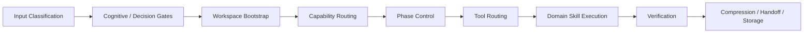

# Governed Skill Tree

> A control layer for AI-agent execution: routing, boundaries, gates, memory, verification, and handoff.

Governed Skill Tree is for people building AI agents that must act inside real projects without turning every instruction into an unsafe tool call.

It is not a prompt collection.
It is not a beginner tutorial.
It is not a bag of reusable vibes.

It is a governed skill system for long-horizon human-AI collaboration: a way to separate intake, routing, phase control, tool choice, risk interception, execution, verification, memory, and communication so agent workflows can grow without becoming prompt soup.

If MCP gives AI hands, this project asks what else must exist before those hands should act: input judgment, missing-referent checks, authority boundaries, execution gates, proportional verification, and durable handoff.

## 60-Second Fit Check

This repository is for you if you are dealing with problems like:

- AI agents executing before the task is understood
- skill folders growing into a flat, overlapping pile
- unclear boundaries between planning, implementation, verification, memory, and handoff
- "go ahead" or "the expert confirmed it" being treated as unsafe implicit approval
- long-running Codex / Claude Code / agent workflows losing continuity across sessions
- real projects where file edits, Unity scenes, git pushes, memory writes, or external state changes need explicit governance

This repository is probably not for you if you only want:

- one-click prompts
- entertainment chat templates
- zero-context productivity tricks
- a universal replacement for every agent framework
- a Unity-only toolkit
- copy-paste magic with no execution model

The goal is not to lower the bar until everyone can use it.
The goal is to make the right people recognize the system quickly.

## 30-Second Example

User request:

```text
Fix the Unity bug and push it to main.
```

An ungoverned agent may:

- edit files immediately
- touch scenes or prefabs without a risk boundary
- skip compile or runtime validation
- commit directly to the wrong branch
- push before the user has approved the delivery step
- summarize vaguely after the damage is already done

A governed skill tree should:

- classify the request as code change + Unity risk + git risk
- check whether the target bug and affected assets are clear
- enter a pre-execution plan gate before modifying files
- separate implementation approval from git delivery approval
- route debugging, implementation, verification, and handoff to different skill families
- record what was validated, what remains uncertain, and what should continue next

That difference is the point.

## 中文简介

这是一个面向真实项目的 AI Agent 执行治理层。

它不是 prompt 合集，也不是新手教程。
它关心的不是让 Agent 看起来更会说，而是让 Agent 在真实工程里更知道：

- 什么时候可以行动
- 什么时候必须停下
- 当前任务应该由哪类 skill 接手
- 哪些回答会影响路线、实现、文档、记忆或外部状态
- 哪些操作必须经过风险门和明确确认
- 验证、交接和记忆应该怎么分层

如果说 MCP 更像是给 AI 补齐"手"和工具调用能力，那么 Governed Skill Tree 关注的是：在动手之前，AI 是否具备足够清楚的输入判断、边界意识、阶段控制、风险拦截、验证和交接能力。

它不承诺消灭幻觉。
它尝试让错前提、缺对象、未经验证的确认和越权指令更难直接变成工具调用、文件改动、记忆写入或项目执行。

## Core Model

Governed Skill Tree separates responsibilities that are often collapsed into one fuzzy prompt layer:

- `brain` handles task classification and capability routing
- `controller` handles work phase and safe phase transitions
- `brain-tool-routing` handles the current execution surface
- `balance` handles assumption audits, dependency scans, and risk gates
- `leg` handles implementation, runtime checks, and delivery support
- `memory` handles layered memory, handoff, and continuity
- `collab` handles human-facing communication and status compression

The separation matters:

- routing is not phase control
- phase control is not tool choice
- tool choice is not risk approval
- input understanding is not execution approval
- growth is not "just add another skill"
- domain packs are not the same thing as the generic core

## System Flow

The default governed intake path:



This is not meant to make every task heavy.
It is meant to make risky transitions explicit.

## First Public Slice

This public version is a deliberate first slice, not the entire internal system.

It includes:

- the governed core
- the metadata model
- the intake pipeline
- cognitive and decision gates
- a Unity showcase pack as one mature domain example
- cases and examples that show why governed structure changes behavior

The Unity pack is included as a flagship domain example, not as the whole identity of the system.

## Where To Start

If you only read one document after this README, read:

- [docs/governance.md](docs/governance.md)

Recommended reading order:

1. [docs/governance.md](docs/governance.md)
   - Authority boundaries, conflict handling, and why the system is governed instead of flattened.
2. [docs/intake-pipeline.md](docs/intake-pipeline.md)
   - How work moves through classification, gates, bootstrap, routing, phase control, tools, execution, verification, and handoff.
3. [docs/decision-and-cognitive-gates.md](docs/decision-and-cognitive-gates.md)
   - How the system handles ambiguous input, missing referents, authority pressure, and action-shaping answers before execution.
4. [SKILL_TREE.md](SKILL_TREE.md)
   - Logical map of the current skill structure, migration status, and layering strategy.
5. [docs/evaluation-notes.md](docs/evaluation-notes.md)
   - Rationale behind the separation model and the failure modes this system is designed to reduce.

## Cases

These cases show how governed skill systems behave differently from flat prompt or skill collections.

- [Flat Skill Pile vs Governed Flow](./cases/flat-skill-pile-vs-governed-flow.md)
  - Why structure matters before scale.
- [Skill Growth Proposal](./cases/skill-growth-proposal.md)
  - Why not every repeated problem should create a new skill.
- [Handoff and Continuity](./cases/handoff-continuity.md)
  - Why long-horizon collaboration needs explicit continuity design.
- [Missing Referent Execution Stop](./cases/missing-referent-execution-stop.md)
  - Why ambiguous "this/that" requests should not trigger tool use or project execution.

## Examples

Start with the example closest to your use case:

- [Ambiguous Task Routing](examples/ambiguous-task-routing.md)
- [Pre-Change Risk And Dependency Scan](examples/pre-change-risk-and-dependency-scan.md)
- [Unity Debug To Runtime Smoke](examples/unity-debug-to-runtime-smoke.md)
- [Evaluating A Skill Growth Request](examples/evaluating-skill-growth-request.md)

## Core Ideas

- `organ-based logical layering`
  - Skills are grouped by the responsibility they own.
- `flat physical storage`
  - Live skills still sit in a flat `skills/` directory for runtime compatibility.
- `hard authority boundaries`
  - Routing, phase control, tool choice, risk interception, execution, and human-facing output do not silently collapse into one layer.
- `input-side safety gates`
  - Ambiguous referents, authority pressure, and action-shaping conclusions are checked before routing turns into execution.
- `task intake pipeline`
  - A task should enter the system in a predictable order.
- `governed growth`
  - The system should grow deliberately instead of becoming a naming graveyard.

## Public Skill Set

### Core Generic Skills

- `brain-workspace-bootstrap`
- `brain-skill-orchestrator`
- `controller-work-state-controller`
- `brain-tool-routing`
- `balance-assumption-audit`
- `balance-dependency-impact-scan`
- `brain-capability-gap-detect`
- `ear-interaction-intent-parse`
- `eye-state-diff-inspector`
- `collab-tone-regulator`
- `memory-memory-router`
- `memory-layered-memory`
- `leg-verification-runner`

### Unity Showcase Pack

- `balance-unity-codex-guard`
- `eye-unity-log-debug`
- `eye-unity-scene-audit`
- `leg-unity-runtime-smoke`

## Repository Layout

```text
.
├─ README.md
├─ SKILL_TREE.md
├─ SKILL_TEMPLATE.md
├─ cases/
├─ docs/
├─ examples/
└─ skills/
```

The `skills/` directory is intentionally flat.
That is part of the runtime compatibility model, not an accident.

## Quick Start

If you want to inspect the system:

1. Read this README for the positioning and boundary.
2. Read [docs/governance.md](docs/governance.md) for authority rules.
3. Read [docs/intake-pipeline.md](docs/intake-pipeline.md) for the execution path.
4. Use [SKILL_TREE.md](SKILL_TREE.md) as the governed index.

If you want to try the structure in a Codex-compatible environment:

1. Copy the skill folders from `skills/` into your `$CODEX_HOME/skills`.
2. Keep the physical layout flat.
3. Use [SKILL_TREE.md](SKILL_TREE.md) as the governed index.
4. Use [SKILL_TEMPLATE.md](SKILL_TEMPLATE.md) for new skill authoring.

## What This Is Not

This repository is intentionally not:

- a giant prompt dump
- a personality pack
- a replacement for every agent framework
- a Unity-only toolkit
- a claim that one naming scheme solves coordination by itself
- a shortcut around human approval for risky execution

The practical goal is to build a skill system that can keep growing without losing routing clarity, safety boundaries, or maintainability.

## Release Notes

- [docs/release-notes-v0.1.1.md](docs/release-notes-v0.1.1.md)
  - Public boundary patch for input safety gates and missing-referent execution stops.
- [docs/release-notes-v0.1.0.md](docs/release-notes-v0.1.0.md)
  - First public slice of the repository.
- [docs/release-scope.md](docs/release-scope.md)
  - What is intentionally included in the public slice, and what is intentionally left out.
- [docs/release-checklist.md](docs/release-checklist.md)
  - Release readiness checklist for this repository.

## Contributing

If you want to extend the tree, start here:

- [CONTRIBUTING.md](CONTRIBUTING.md)
- [SKILL_TEMPLATE.md](SKILL_TEMPLATE.md)

New public skills should strengthen the governance model, not bypass it.

## Roadmap

Near-term priorities:

- refine more public examples
- add clearer domain-pack boundaries
- publish evaluation and comparison notes
- expand beyond the first showcase pack carefully

## License

This repository is licensed under [Apache-2.0](LICENSE).
