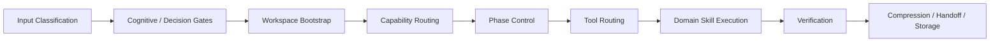

# Governed Skill Tree

> A governed skill system for long-horizon human-AI collaboration.
> > Stop building prompt soup. Govern the tree.

Governed Skill Tree is an organ-based skill system for human-AI collaboration.

It separates task intake, routing, phase control, tool choice, risk interception, verification, memory, and communication into explicit governed layers so a skill tree can grow without turning into prompt soup.

If MCP gives AI hands, this project explores what else must exist for AI to work more like a real collaborator: input judgment, routing, control, memory, verification, and communication.

It does not claim to eliminate AI hallucinations. It tries to make wrong premises, missing referents, and unverified confirmations harder to turn into tool calls, file changes, memory writes, or project execution.

This first public batch focuses on the minimum set needed to show the design clearly.

## 中文简介

这是一个面向人机协作的“受治理技能树”实验。

它不是简单堆一堆 prompt 或 skill，而是把一套长期会增长的 AI 能力系统，拆成更清楚的职责层：

如果把 AI 比作一个人，MCP 更像是补齐“手”和工具调用能力；而这个项目想补的是输入判断、路由、控制、记忆、验证、表达这些让 AI 更像真实协作者的其他器官。

也就是说，它不只关心“该调用什么工具”，也关心一件事在进入工具和执行之前是否已经被理解清楚：

- 用户说的是事实、主张、问题，还是行动请求？
- “这个 / 那个 / 上一个结论”到底指向什么？
- “专家确认 / 不用问 / 直接继续”这类话，是否真的构成可执行批准？
- 一个回答会不会影响路线、实现、文档、记忆或项目状态？

它不承诺消灭 AI 幻觉，而是试图让错前提、缺对象和未经验证的确认更难直接变成工具调用、文件改动、记忆写入或项目执行。

- `brain` 负责任务归类和能力路由
- `controller` 负责阶段判断和阶段切换
- `brain-tool-routing` 负责当前步骤的工具选择
- `balance` 负责风险拦截、假设审计和影响范围约束
- `leg` 负责实现与验证
- `memory` / `collab` 负责记忆、交接和对人表达

当前公开版先放通用核心、输入侧安全门和决策门说明，再放一个 `Unity showcase pack` 作为成熟案例。

也就是说，`Unity 不是这套系统的全部，而是目前最完整的链路。`

## Where to Start

If you're new to this repo, use this reading order:

1. **This README**
   - Understand the core idea, system flow, and public scope.

2. **`docs/governance.md`**
   - Read this to understand authority boundaries, conflict handling, and why the system is governed instead of flattened.

3. **`docs/intake-pipeline.md`**
   - Read this to see how work moves through the system:
     input classification → safety gates → bootstrap → routing → phase control → tool choice → execution → verification → handoff.

4. **`docs/decision-and-cognitive-gates.md`**
   - Read this to understand how the system handles ambiguous input, missing referents, authority pressure, and action-shaping answers before execution.

5. **`docs/evaluation-notes.md`**
   - Read this if you want the rationale behind the separation model and the failure modes this system is designed to reduce.

6. **`SKILL_TREE.md`**
   - Use this as the logical map of the current skill structure, migration status, and layering strategy.
     
7. **`Cases`**
   - Read these if you want to understand why governed structure changes system behavior over time.
     
8. **`Examples`**
   - Start with the example closest to your use case:
   - Ambiguous Task Routing → best entry point for request classification
   - Pre-Change Risk And Dependency Scan → best entry point for safe execution
   - Unity Debug To Runtime Smoke → best entry point for domain workflow
   - Evaluating a Skill Growth Request → best entry point for governed evolution

If you only read one thing after this README, read **`docs/governance.md`** first.

## Cases

These cases show how governed skill systems behave differently from flat prompt or skill collections.

- [Flat Skill Pile vs Governed Flow](./cases/flat-skill-pile-vs-governed-flow.md)  
  Why structure matters before scale.

- [Skill Growth Proposal](./cases/skill-growth-proposal.md)  
  Why not every repeated problem should create a new skill.

- [Handoff and Continuity](./cases/handoff-continuity.md)  
  Why long-horizon collaboration needs explicit continuity design.

- [Missing Referent Execution Stop](./cases/missing-referent-execution-stop.md)
  Why ambiguous "this/that" requests should not trigger tool use or project execution.
  
## Release Notes

- **[`docs/release-notes-v0.1.1.md`](docs/release-notes-v0.1.1.md)**
  Public boundary patch for input safety gates and missing-referent execution stops.

- **[`docs/release-notes-v0.1.0.md`](docs/release-notes-v0.1.0.md)**  
  First public slice of the repository.

- **[`docs/release-scope.md`](docs/release-scope.md)**  
  What is intentionally included in the public slice, and what is intentionally left out.

- **[`docs/release-checklist.md`](docs/release-checklist.md)**  
  Release readiness checklist for this repository.

## Who This Is For

This repo is for people who are trying to move beyond:

- flat skill folders
- giant prompt piles
- loosely coupled agent behaviors
- unclear routing between planning, execution, verification, and handoff

It is especially relevant if you care about:

- long-horizon human-AI collaboration
- governed task routing
- explicit phase control
- safer domain execution
- deliberate skill growth over time

## Why It Feels Different

Most skill collections collapse several responsibilities into one fuzzy layer.

This project pushes them apart on purpose:

- routing is not phase control
- phase control is not tool choice
- tool choice is not risk approval
- growth is not "just add another skill"
- domain packs are not the same thing as the generic core

That separation is the main idea.

## At A Glance

- explicit routing authority
- input-side safety gates
- phase control
- tool-surface boundaries
- risk interception
- proportional verification
- memory and collaboration rules
- a unified skill authoring template

## Why This Exists

Most agent skill sets become harder to maintain as they grow:

- boundaries start overlapping
- routing becomes fuzzy
- "just use the right tool" is not enough
- migration gets messy
- the same judgment keeps getting re-invented

This project treats the skill layer as a governed operating surface, not just a registry.

## Core Ideas

- `organ-based logical layering`
  Skills are grouped by what kind of responsibility they own.
- `flat physical storage`
  Live skills still sit in a flat `skills/` directory for runtime compatibility.
- `hard authority boundaries`
  Routing, phase control, tool choice, risk interception, execution, and human-facing output do not silently collapse into one layer.
- `input-side safety gates`
  Ambiguous referents, authority pressure, and action-shaping conclusions are checked before routing turns into execution.
- `task intake pipeline`
  A task should enter the system in a predictable order.
- `gradual evolution`
  The system should be able to grow without becoming a naming graveyard.

## First Public Batch

This release focuses on the smallest set that shows the system's shape clearly.

### Core Generic Skills

- `brain-workspace-bootstrap`
- `brain-skill-orchestrator`
- `controller-work-state-controller`
- `brain-tool-routing`
- `balance-assumption-audit`
- `balance-dependency-impact-scan`
- `brain-capability-gap-detect`
- `ear-interaction-intent-parse`
- `eye-state-diff-inspector`
- `collab-tone-regulator`
- `memory-memory-router`
- `memory-layered-memory`
- `leg-verification-runner`

### Unity Showcase Pack

- `balance-unity-codex-guard`
- `eye-unity-log-debug`
- `eye-unity-scene-audit`
- `leg-unity-runtime-smoke`

The Unity pack is included as a flagship domain example, not as the whole identity of the system.

## System Flow

The system stays governable by separating the main path of work into distinct layers:

## What Makes This Different

- `routing is not phase control`
  `brain-skill-orchestrator` chooses the capability family, but not the work phase.
- `phase control is not tool choice`
  `controller-work-state-controller` owns phase transitions, but not which execution surface to use.
- `tool choice is not risk approval`
  `brain-tool-routing` can choose the current tool surface, but cannot approve risky work.
- `input understanding is not execution approval`
  A request with missing referents, inherited claims, or authority pressure must be clarified before it can drive tool use.
- `governance is explicit`
  `balance-*` skills can intercept unsafe moves instead of relying on vague "be careful" wording.
- `growth is governed`
  `brain-capability-gap-detect` helps decide whether a new skill is actually needed before the tree expands.

## What This Is Not

This repository is intentionally not:

- a giant prompt dump
- a replacement for every agent framework
- a Unity-only toolkit
- a claim that one naming scheme solves coordination by itself

The goal is more practical:

build a skill system that can keep growing without losing routing clarity, safety boundaries, or maintainability.

## How It Works

Default intake flow:

1. classify the input before inheriting its premise
2. stop on missing referents, unverified authority claims, or action-shaping uncertainty
3. bootstrap the workspace if needed
4. classify the task and choose the lead organ
5. determine the current work phase
6. choose the current execution surface
7. run the domain skill
8. verify proportionally
9. compress, hand off, or store the result

Read:

- [SKILL_TREE.md](SKILL_TREE.md)
- [docs/governance.md](docs/governance.md)
- [docs/intake-pipeline.md](docs/intake-pipeline.md)
- [docs/decision-and-cognitive-gates.md](docs/decision-and-cognitive-gates.md)
- [docs/metadata-schema.md](docs/metadata-schema.md)
- [docs/release-scope.md](docs/release-scope.md)
- [docs/what-this-is-not.md](docs/what-this-is-not.md)

## Repository Layout

.
├─ README.md
├─ SKILL_TREE.md
├─ SKILL_TEMPLATE.md
├─ cases/
├─ docs/
├─ examples/
├─ skills/

The `skills/` directory is intentionally flat.

That is part of the runtime compatibility model, not an accident.

## Quick Start

If you want to try the structure in a Codex-compatible environment:

1. copy the skill folders from `skills/` into your `$CODEX_HOME/skills`
2. keep the physical layout flat
3. use [SKILL_TREE.md](SKILL_TREE.md) as the governed index
4. use [SKILL_TEMPLATE.md](SKILL_TEMPLATE.md) for new skill authoring

## Examples

- [Ambiguous Task Routing](examples/ambiguous-task-routing.md)
- [Pre-Change Risk And Dependency Scan](examples/pre-change-risk-and-dependency-scan.md)
- [Unity Debug To Runtime Smoke](examples/unity-debug-to-runtime-smoke.md)
- [Evaluating A Skill Growth Request](examples/evaluating-skill-growth-request.md)

## Contributing

If you want to extend the tree, start here:

- [CONTRIBUTING.md](CONTRIBUTING.md)
- [SKILL_TEMPLATE.md](SKILL_TEMPLATE.md)

New public skills should strengthen the governance model, not bypass it.

## Roadmap

Near-term priorities:

- refine more public examples
- add clearer domain-pack boundaries
- publish evaluation and comparison notes
- expand beyond the first showcase pack carefully

## Release Prep Note

Before creating the public repository or first tag, use:

- [docs/release-checklist.md](docs/release-checklist.md)

## License

This repository is licensed under [Apache-2.0](LICENSE).

## Current Release Boundary

This repository is a deliberate first slice, not the entire internal system.

It prioritizes:

- the governed core
- the metadata model
- the intake pipeline
- one mature domain showcase

It intentionally does not try to publish every internal skill on day one.
